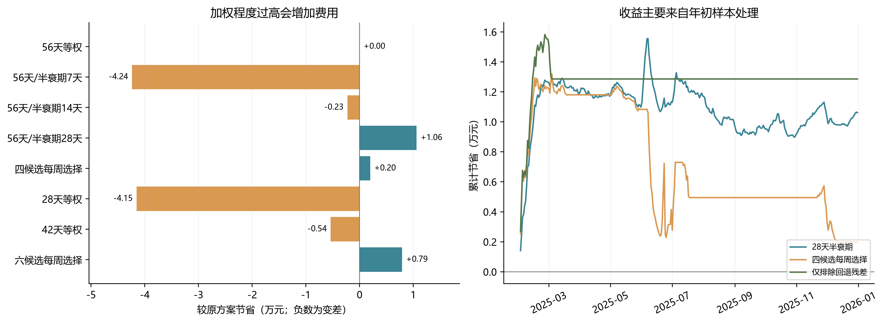

# 方案B滚动窗口优化结果

**结论：近期加权和缩短窗口没有显示稳定的额外收益；本轮推荐修正有效残差筛选，保留原56天等权及48小时前瞻。**

原目录基线已精确复现：**14,401,996.98元**。推荐方案为 **14,389,135.08元**，减少 **12,861.89元（0.0893%）**。这个收益归因于排除回退预测残差，不归因于指数加权。

**费用统计期为2025年2月1日至12月31日，共334天；1月仅作共同预热，不计入下表费用。** 所有方案共享原等权1月预热，2月1日SOC为8550 kWh，12月31日为6000 kWh。原目录名“1439万”不是当前保存结果的精确值；这里统一与目录中1440.20万元结果比较。

## 1. 保持原样本口径的窗口实验

| 方法 | 2—12月费用（元） | 较原基线节省（元，负数为变差） | 紧急电量（kWh） |
|---|---:|---:|---:|
| 56天等权 | 14,401,996.98 | +0.00 | 237,775.35 |
| 56天/半衰期7天 | 14,444,376.04 | -42,379.06 | 258,228.71 |
| 56天/半衰期14天 | 14,404,271.57 | -2,274.59 | 244,460.92 |
| 56天/半衰期28天 | 14,391,380.10 | +10,616.87 | 237,997.14 |
| 四候选每周选择 | 14,400,010.55 | +1,986.43 | 248,441.62 |
| 28天等权 | 14,443,538.21 | -41,541.23 | 250,845.99 |
| 42天等权 | 14,407,394.33 | -5,397.35 | 241,795.11 |
| 六候选每周选择 | 14,394,083.20 | +7,913.78 | 245,567.79 |

28天半衰期在统计期内减少 10,616.87 元，其中2月减少 12,638.73 元，3—12月合计反而增加 2,021.86 元。其下半年费用比原等权增加 724.23 元。

固定候选的年度回测最佳属于回顾性比较，不能直接称为严格独立测试后的最优参数。两种每周选择方案均只使用此前已实现的预测损失，未使用当天或未来实际值。

## 2. 为什么要修正有效残差

原负载预测器在1月1—7日没有同星期几历史，使用附件1典型日回退；1月8日起才具有至少一次同星期几历史。原 residual_matrix 把前7天回退预测的误差也算作正常残差。文档声称的“预热残差为NaN”未落实到代码。

前7天残差是合法的因果预测误差，并非数值或计算错误。这里的“有效残差”指由具有同星期历史的预测器产生、与后续运行口径更一致的误差；是否适合剔除，要通过对照检验判断。

因此采用由预测器可用性决定的边界：场景历史仅取 day >= 7（1月8日起），而非通过遍历全年费用挑选截断日。预测器、效率、功率、前瞻和原始数据均保留。2月1日使用24条有效残差，之后增至最多56条。

## 3. 排除前7天回退残差后的配对检验

| 方法 | 总费用（元） | 较有效残差等权基线增加（元） |
|---|---:|---:|
| 56天等权 | 14,389,135.08 | +0.00 |
| 56天/半衰期28天 | 14,390,031.13 | +896.04 |
| 四候选每周选择 | 14,399,216.51 | +10,081.43 |

在这组更一致的历史误差口径下，加权与四候选在线选择都没有优于等权。因此最终交付采用“有效残差 + 56天等权”，不把第一组中偏向近期的表面收益解释为普遍有效。

## 4. 推荐结果与变化解释

| 项目 | 原方案（元） | 推荐方案（元） |
|---|---:|---:|
| 计划购电费 | 13,508,190.55 | 13,462,061.30 |
| 紧急购电费 | 893,806.43 | 927,073.78 |
| 总费用 | 14,401,996.98 | 14,389,135.08 |

排除来自回退预测、与正常预测器口径不同的早期残差后，计划购电费用下降。紧急购电有所增加，但计划费减少更多，所以总费用下降。该模型的目标始终是总费用，不是紧急电量单独最小。

**这是启动阶段的改善。** 2月节省 15,521.02 元，3月增加 2,659.13 元；最后一个费用有差异的日期为 2025-03-04，3月5日至12月31日逐日费用与原方案一致。这不能解释为全年持续适应能力的提高。

可使用根目录 [result2.xlsx](result2.xlsx)、[daily_summary.csv](daily_summary.csv)、`schedule_detail.csv.gz`。它们与已独立核验的有效残差等权方案逐字节一致；[summary.json](summary.json)记录来源。原方案文件没有修改，第三问没有重算。

## 5. 已完成核验

- 11组完整统计期方案均逐段复算48,096个时段，并反读各自Excel三表；检查能量守恒、效率、功率、SOC、互斥、跨日、初末、电价、实际净负载、缺口和总费用。
- 基线费用与原目录汇总一致；分时充放电导出按24段/4小时，表头按真实00:00—00:10起始时段修正。
- 在2月1日、6月1日、11月30日修改当天及未来负载/光伏，重建预测、残差、评分及LP后，当前选择和控制量均不变；周内后来发生的误差不会反向改变已选窗口。
- 两组有解析解的加权LP费用分别为34,200与57,600元，与求解器一致。人工注入SOC、电价、缺口、时段和Excel错误能被核验器拒绝。
- 核验范围见 `verification_all.json`、三个实验根目录的 `verification.json` 及 `information_verification.json`。

## 6. 结论边界

这里检验的是继承方案B参数后的滚动执行与窗口规则。原预测参数当初如何选择仍依赖其研发记录；本次未来扰动检查不能证明原参数选择没有使用过测试年信息。此次结果也不证明56天对其他年份最优。

截断日依据预测器可用性确定，但推荐方案的费用改善来自同一年度回测，尚未经过另一个年份的独立验证。

原方案中光伏点预测可能为负、1月预热使用附件1回退等其他口径保持不变，未把这些独立问题混入本次收益。次日仍只用点预测，未延长前瞻，也未开放日内重新调度。

