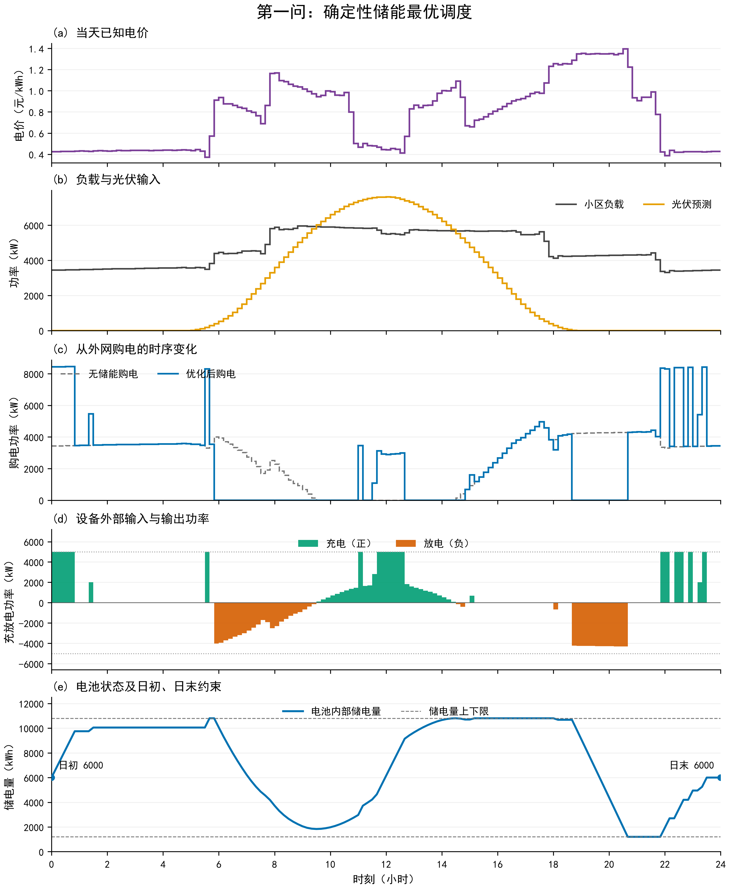
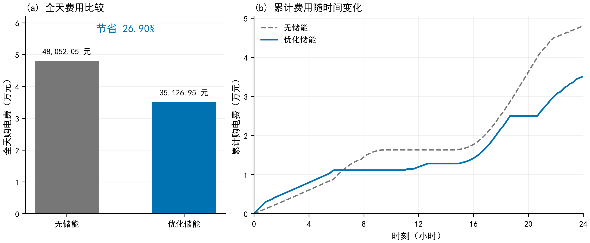

# 第一问：确定性储能调度优化

按充、放电效率各为 90%，初末储电量均为 6000 kWh，功率取设备外部端口口径，且允许弃光、不考虑售电，得到全天最优购电量 **59482.70 kWh**、最优购电费 **35126.95 元**。相对于同一负载、光伏条件下的无储能方案，节省 **12925.10 元，降幅 26.90%**。

本次从 `../raw/C题.pdf`、`../raw/附件/附件1.xlsx` 和 `../raw/附件/附件5/result1.xlsx` 重新建模计算。业务输入只使用这三个文件。所有代码和结果均保存在本目录。

**题目要求与数据口径**

题目第 1 页要求：在每天 0:00 制定全天计划购电策略，满足每个时段的负载，且日初、日末储电量相同；按表 1、表 2 给出指定时段结果，填写 `result1.xlsx`。第 2 页附录 1 给出了储能容量、功率、初始储电量和效率，第 3 页规定了输出工作表。

附件 1 实际包含 144 条记录，时间戳从 00:10 到 0:00+1，间隔均为 10 分钟。电价、负载、光伏三列均没有缺失、非有限值或负值，时间连续且没有重复。电价范围为 0.3713—1.3952 元/kWh，负载范围为 3309.3934—5958.9696 kW，光伏功率范围为 0—7612.316 kW。未对这些数值进行平滑、插值或异常值删除。

采用用户给定的时段解释：每行数据为该时间戳之前十分钟内的平均功率与适用电价，即 00:10 对应 00:00—00:10，0:00+1 对应 23:50—24:00。这是离散化假设，题面没有明确指定时间戳是左端点还是右端点。

原始结果模板的“计划购电量”第一行时间为 `0:10-0:20`，最后一行为 `0:00+1-0:10+1`，覆盖 00:10 至次日 00:10，与上述口径不一致。本次保留两张工作表及其结构，在输出副本中把时间标签统一为当天 `0:00-0:10` 至 `23:50-24:00`。原始模板保持原样。**若后续确定需要采用左端点口径，必须同步重新核对日界、初始状态和论文表格，不能直接把当前数值按原模板行号平移填写。**

**假设与参数**

| 内容 | 本次取值或解释 | 来源与作用 |
|---|---|---|
| 时段长度 | $\Delta t=1/6$ h | 附件的十分钟间隔 |
| 日内负载、光伏、电价 | 当天 0:00 已知，按给定值运行 | 第一问的确定性计划口径 |
| 额定容量 | 12000 kWh | 附录 1 |
| 允许储电范围 | 1200—10800 kWh | 附录 1；额定容量不等于可使用范围 |
| 初始与终止储电量 | $E_0=E_{144}=6000$ kWh | 采用附录给出的初始值，加上第一问的日末回归要求 |
| 充、放电效率 | $\eta_c=\eta_d=0.9$ | 将“充放电效率为 90%”解释为两个单向效率；综合效率为 81% |
| 最大充、放电功率 | 均为 5000 kW | 按设备外部充电输入端、放电输出端解释 |
| 弃光与售电 | 可弃光，不向外网售电 | 未提供售电价格；用非负购电量与弃光量表达 |
| 同时充放电 | 同一十分钟内不允许 | 作为储能运行的物理互斥要求，用二元变量显式表示 |
| 其他运行成本 | 不额外加入衰减、启停成本、自放电和需量电费 | 题目未给相应参数，目标采用购电费用 |
| 外网购电容量 | 不附加外网功率上限 | 5000 kW 是储能设备限制，不能误加在外网购电上 |

效率和功率端口的解释会影响数值，因此须在论文中明确。若把 90% 解释为整个往返过程效率，或者把功率上限施加在电池内部端口，需要改写约束并重新求解，不能直接引用本报告费用。

**变量与数学模型**

令 $t=1,\ldots,144$，将功率转换成电量：

$$
L_t=P_t^{\rm load}\Delta t,\qquad V_t=P_t^{\rm PV}\Delta t.
$$

| 符号 | 含义 | 单位 |
|---|---|---|
| $p_t$ | 第 $t$ 时段电价，已知 | 元/kWh |
| $L_t,V_t$ | 负载电量、预测光伏电量，已知 | kWh |
| $g_t$ | 外网购电量 | kWh |
| $c_t$ | 微网输入充电设备的电量 | kWh |
| $d_t$ | 放电设备输出给微网的电量 | kWh |
| $E_t$ | 第 $t$ 时段结束时电池内部储电量 | kWh |
| $w_t$ | 未被微网使用的光伏电量 | kWh |
| $z_t$ | 充电开关；0 时仅允许放电或待机，1 时仅允许充电或待机 | 无量纲，0/1 |

目标函数为：

$$
\min F=\sum_{t=1}^{144}p_tg_t.
$$

逐时供需平衡与弃光约束为：

$$
g_t+V_t+d_t=L_t+c_t+w_t,\qquad g_t\geq0,\quad 0\leq w_t\leq V_t.
$$

这是对原思路的最小补充：引入弃光量，明确多余能量的去向。仅写“供给大于等于需求”的可行域还可能允许丢弃购入电量或放电电量，与显式限制“只能弃光”的可行域并非逐点相同。本次采用后者，所得最优费用仍与初算一致。

电池内部能量递推为：

$$
E_t=E_{t-1}+\eta_c c_t-\frac{d_t}{\eta_d}
    =E_{t-1}+0.9c_t-\frac{d_t}{0.9}.
$$

充入 100 kWh 使内部电量增加 90 kWh；对外输出 90 kWh 使内部电量减少 100 kWh。因此，放电项必须除以效率。

容量与循环约束为：

$$
1200\leq E_t\leq10800,\qquad E_0=6000,\qquad E_{144}=6000.
$$

将 5000 kW 换算为每时段电量上限 $M=5000/6$ kWh，互斥限制为：

$$
0\leq c_t\leq Mz_t,\qquad
0\leq d_t\leq M(1-z_t),\qquad z_t\in\{0,1\}.
$$

这构成 MILP。其约束保证每个十分钟内只充电、只放电或待机。由于每时段功率按常数处理，电池内部能量在该时段内线性变化；时段两端满足容量上下限即可保证时段内也满足。

本次先解 LP：去掉 $z_t$，仅保留 $0\leq c_t,d_t\leq M$，再解显式 MILP。LP 有 720 个连续变量，MILP 另有 144 个二元变量。程序分别调用 SciPy 的 [linprog](https://docs.scipy.org/doc/scipy/reference/generated/scipy.optimize.linprog.html) 和 [milp](https://docs.scipy.org/doc/scipy/reference/generated/scipy.optimize.milp.html)，使用 HiGHS 求解器。

**为什么能认定得到最优解**

本次 LP 最优解不存在 $c_t>10^{-6}$ 且 $d_t>10^{-6}$ 的时段，因此可以给它配置满足互斥约束的 $z_t$，成为 MILP 可行解。记两类模型的最优费用分别为 $F_{\rm LP}^*$ 和 $F_{\rm MILP}^*$，则：

$$
F_{\rm LP}^*\leq F_{\rm MILP}^*\leq F(x_{\rm LP}^*)=F_{\rm LP}^*.
$$

故两者最优费用相等。这一结论依赖于本次 LP 最优解确实满足互斥，不能仅凭“通常不会同时充放电”就省略检查。

显式 MILP 的实际运行也返回最优状态，费用与 LP 相同，报告的相对最优间隙为 0；LP 原始目标与对偶目标一致。最终表格采用已满足物理互斥的 LP 调度。最优费用得到证实，不额外声称每一个时段的调度唯一；同价等情形可能对应不同的等价最优调度。

**计算结果**

| 指标 | 无储能 | 优化储能 |
|---|---:|---:|
| 全天负载电量 / kWh | 111024.81 | 111024.81 |
| 全天光伏预测电量 / kWh | 55482.84 | 55482.84 |
| 全天外网购电量 / kWh | 61789.94 | **59482.70** |
| 全天购电费用 / 元 | 48052.05 | **35126.95** |
| 弃光量 / kWh | 6247.96 | **0.00** |
| 光伏消纳率 | 88.74% | 100.00% |
| 储能外部充电量 / kWh | 0.00 | 20740.67 |
| 储能外部放电量 / kWh | 0.00 | 16799.94 |
| 储能充放电损耗 / kWh | 0.00 | 3940.73 |

无储能对照采用 $g_t^{(0)}=\max(L_t-V_t,0)$，即光伏优先供应负载、不足部分外购，剩余光伏弃用。光伏消纳率按 $1-\sum w_t/\sum V_t$ 定义，包括进入储能的光伏电量，不等同于最终到达负载的效率。

储能降低费用的同时，本算例外购电量也减少约 2307.24 kWh。原因是储能吸收了原本弃用的 6247.96 kWh 光伏，抵消 3940.73 kWh 的储能损耗后仍有净收益。不能据此泛化为“储能总能降低购电量”：若没有多余光伏，储能套利反而可能因损耗增加外购电量。

题目指定的两张表如下，另有可直接复制的 [paper_tables.md](paper_tables.md)。

**表 1　微网在指定时间段的购电量及全天的购电量和购电费**

| 时间段 | 购电量 | 时间段 | 购电量 | 时间段 | 购电量 |
|---|---:|---|---:|---|---:|
| 10:00-10:10 | 0.00 | 12:00-12:10 | 480.41 | 14:00-14:10 | 0.00 |
| 16:00-16:10 | 445.43 | 18:00-18:10 | 531.89 | 20:00-20:10 | 0.00 |
| 全天购电量 | 59482.70 | 全天购电费 | 35126.95 | — | — |

**表 2　储能设备在指定时间段的充放电量及 0:00 和 24:00 的储电量**

| 时间段 | 充电量 | 放电量 | 时间段 | 充电量 | 放电量 |
|---|---:|---:|---|---:|---:|
| 0:00-4:00 | 4500.00 | 0.00 | 4:00-8:00 | 833.33 | 6365.84 |
| 8:00-12:00 | 4787.96 | 1703.00 | 12:00-16:00 | 5286.04 | 91.10 |
| 16:00-20:00 | 0.00 | 5780.13 | 20:00-24:00 | 5333.33 | 2859.87 |
| 0:00 储电量 | 6000.00 | — | 24:00 储电量 | 6000.00 | — |

表中电量均为 kWh，费用为元。四小时段内充电总量、放电总量同时为正，表示不同十分钟子时段采用不同动作，不代表同一时段同时充放电。展示值保留两位小数，汇总先使用完整精度求和再舍入；`result1.xlsx` 和 CSV 均保留计算精度。

**调度规律与经济解释**

1. **凌晨选低价时段补电。** 00:00—00:50、01:20—01:30 充电，将内部储电量提高到 10050 kWh；没有立即充满，而是为 05:30—05:40 的最低电价 0.3713 元/kWh 留下 750 kWh 内部容量，在该时段充满至 10800 kWh。
2. **早高价时段释放储能。** 05:50—09:30 放电共 8068.84 kWh，09:30 的内部储电量降至 1834.62 kWh。这既替代了较贵的外购电，也为接纳随后增加的光伏腾出空间。
3. **白天结合剩余光伏和较低电价补电。** 09:30—14:30 充电共 9961.53 kWh，于 14:30 达到 10800 kWh。电价较高时仍可能充电，因为充电可以来自多余光伏。例如 10:00—10:10 负载需要 982.91 kWh，光伏提供 1099.90 kWh，多余的 116.98 kWh 进入储能，外购电为 0。
4. **中午光伏充足时，外购电仍可能最划算。** 12:00—12:10 电价仅为 0.4411 元/kWh；光伏扣除负载后剩余 352.92 kWh，但计划充电达到 833.33 kWh 上限，因此再买 480.41 kWh，为更贵的晚间储备电量。这解释了表 1 中午购电量不为零。
5. **午后保留电量供晚高峰使用。** 14:30—14:50 有少量放电，15:00—15:10 再补充，之后多数时段待机。16:00—16:10 虽有供电缺口，电池仍待机并购买 445.43 kWh，因为有限储电量用于稍后更高电价的时段收益更大。
6. **晚高峰集中放电，夜间恢复日初状态。** 18:00—18:10 先少量放电，18:40—20:40 集中放电，于 20:40 达到 1200 kWh 下限；21:50 后在若干低价时段充电，23:30 恢复 6000 kWh，并保持至 24:00。完整的每十分钟动作见 `dispatch_detail.csv`。

作为直观判断，在忽略容量竞争和其他时段约束时，时段 $a$ 外购 1 kWh 充电，最多能在时段 $b$ 向负载输出 $0.81$ kWh，只有 $p_b>p_a/0.81$ 才有正的直接套利收益。实际调度还受光伏、容量、功率与日末回归约束共同影响，所以不能只按固定峰谷时段机械充放电。

本结果仅限制储能设备最大功率。外网购电峰值约为 8458.83 kW，超过 5000 kW 是因为同时给负载供电和给储能充电，符合当前模型。若实际存在并网变压器容量限制，应在获得该参数后增加外网购电上限。

费用曲线显示：凌晨为充电提前购买电量，优化方案的累计费用可能暂时高于对照；在早、晚高价时段减少外购后，全天费用降至 35126.95 元。评价目标是全天总费用，而非每个时刻累计费用均较低。

**已经完成的核验**

| 核验项目 | 实际结果 |
|---|---|
| LP 求解状态 | 最优；目标 35126.94858928963 元 |
| LP 对偶目标 | 35126.94858928963 元；原始—对偶间隙 0 |
| 显式 MILP | 最优；同一目标值；求解器报告相对间隙 0 |
| 逐时供需平衡最大误差 | 约 $2.27\times10^{-13}$ kWh |
| 独立累计公式重建储电量最大误差 | 约 $7.28\times10^{-12}$ kWh |
| 储电量范围 | 1200—10800 kWh |
| 日末电量误差 | 0 kWh |
| 充放电、购电、弃光边界 | 无超限 |
| 同时充放电 | 0 个时段，判断阈值 $10^{-6}$ kWh |
| 导出的 Excel 与 CSV | 144 条购电量、全部时段标签、六组充放电量及初末电量一致 |
| 另一种累计电量 LP | 35126.94858928962 元，与导出策略费用相差约 $1.46\times10^{-11}$ 元 |
| 原始输入文件 | 与求解时记录的 SHA-256 值一致 |

独立复核脚本 `verify.py` 不导入 `solve.py`，只保留 $g,c,d$ 三组变量，按

$$
E_t=6000+\sum_{i=1}^{t}\left(0.9c_i-\frac{d_i}{0.9}\right),\qquad
L_t-V_t\leq g_t-c_t+d_t\leq L_t
$$

重新构造 LP。该复算使用不同的状态表达，仍使用同一 SciPy/HiGHS 求解器，因此属于独立约束实现复算，不声称是另一种求解器的交叉认证。落盘核验共 54 项数值比较全部通过，详见 `verification.json`。

还可由日末回归直接验证：

$$
\sum_t d_t=0.81\sum_t c_t,
$$

以及全天能量守恒：

$$
\sum_t g_t+\sum_t V_t
=\sum_t L_t+\sum_t w_t+\sum_t(c_t-d_t).
$$

这两式均用未舍入数据通过核验。两张最终 PNG 已打开检查中文、单位、图例、时间轴和曲线；同时保留了 PDF 矢量版本。

**本次取舍与未采用方案**

- 保留用户提出的确定性 LP/MILP 路线，只补充显式弃光记录和模板时间对应。不引入预测误差、紧急购电或滚动调整，它们属于其他问题的条件。
- 未采用“低价就充满、高价就放空”的固定规则，因为它不能同时处理光伏接纳、未来价格差异与日末电量恢复。
- 未采用动态规划、遗传算法或粒子群。当前目标和约束均为线性结构，LP/MILP 可以直接给出可行性与最优性证据，无需引入状态离散误差或启发式误差。
- 未只检查费用相同就宣布正确：同时检查了物理约束、导出文件和不同约束实现下的费用下界。
- 未添加电池衰减惩罚或充放电平滑目标，因为题目没有参数依据，附加目标可能改变原题购电费最小的含义。若需要在等价最优策略间减少切换，应另设第二层目标并重新说明。

本次不涉及既有求解代码的修改。单独处理的问题是原始模板时间标签与当前建模口径的错位，修正仅发生在输出副本。
