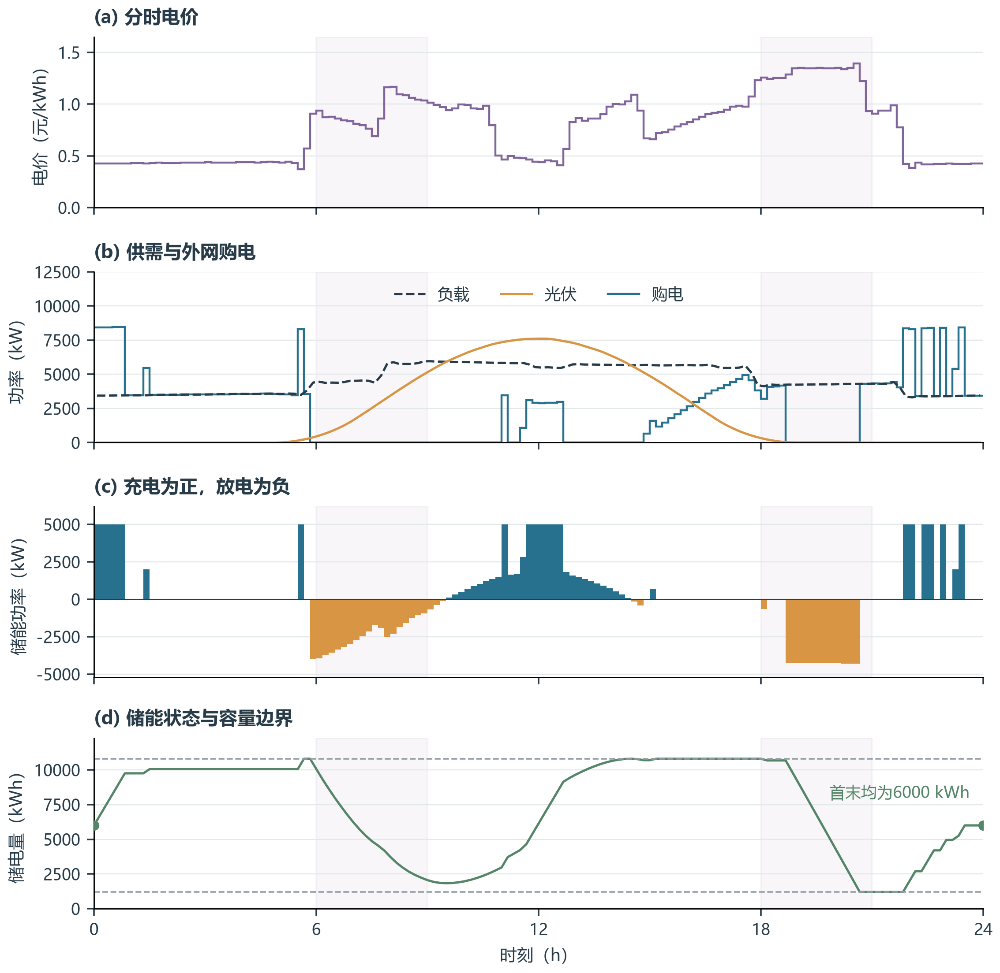
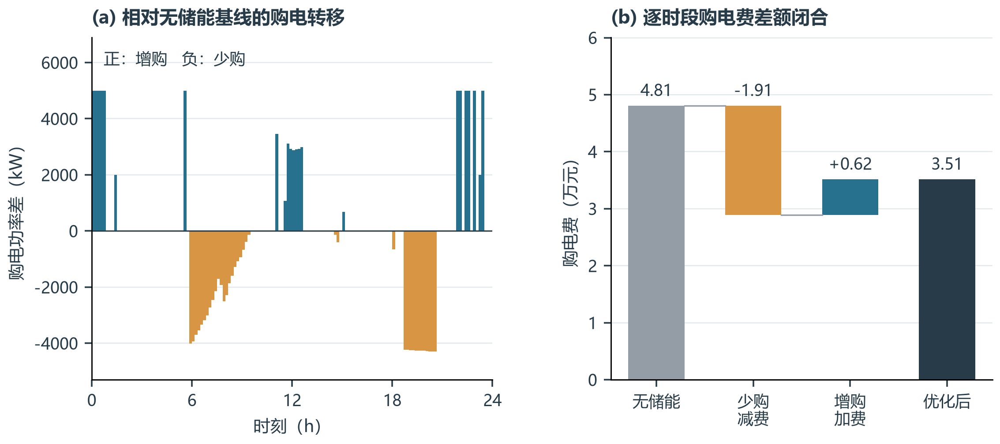
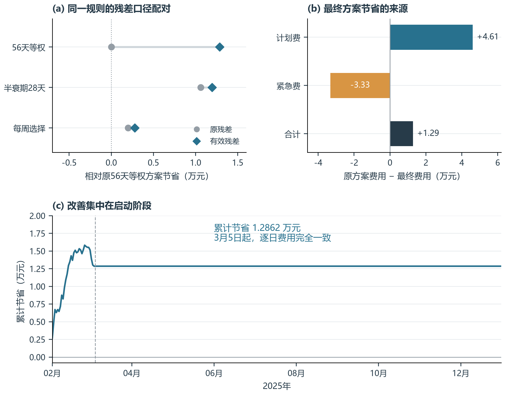
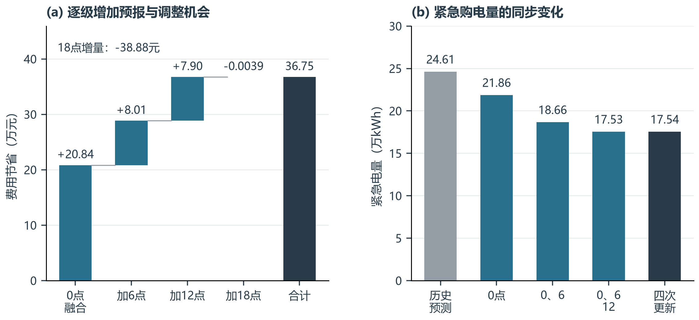
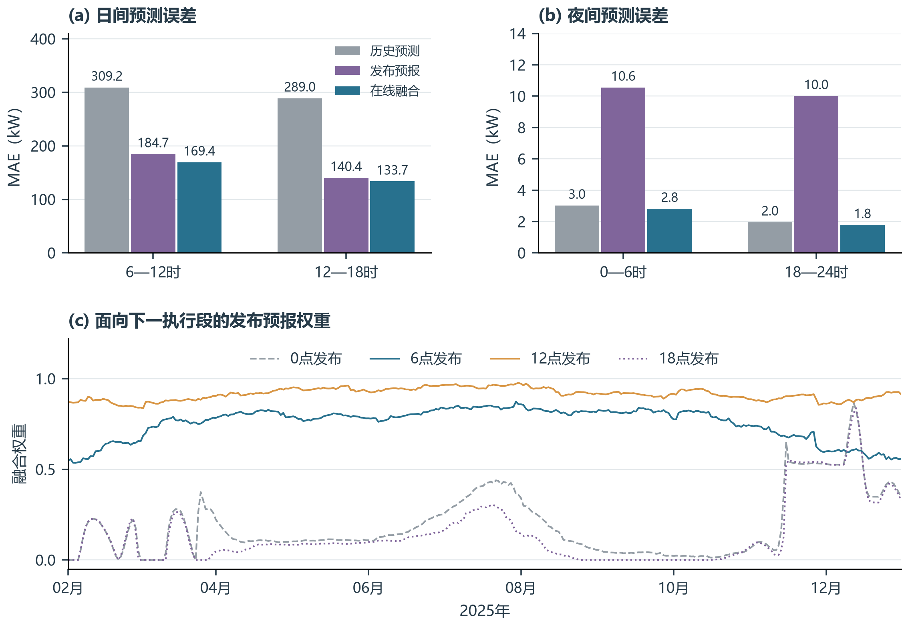
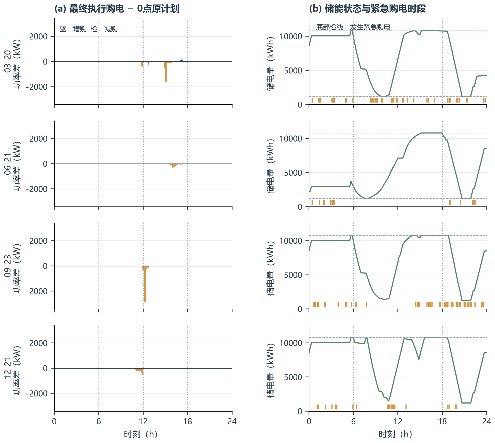
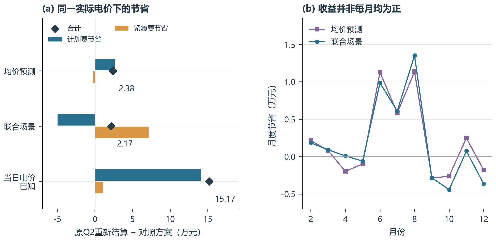
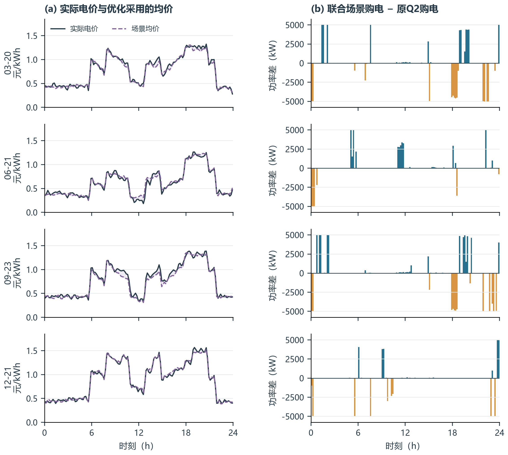
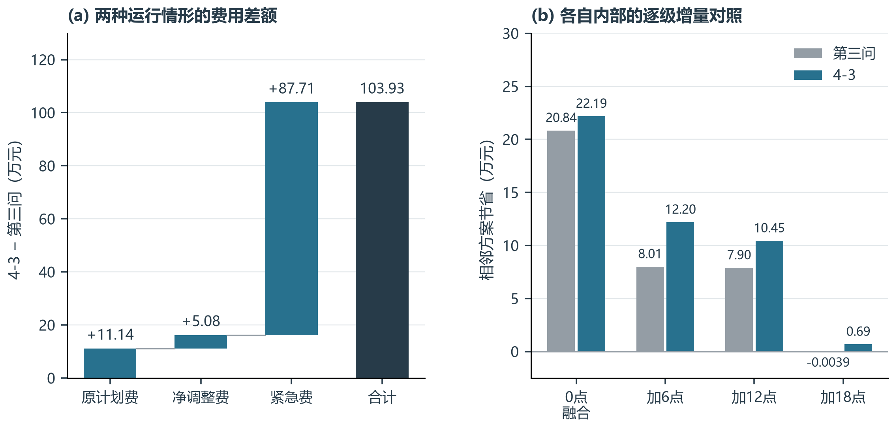
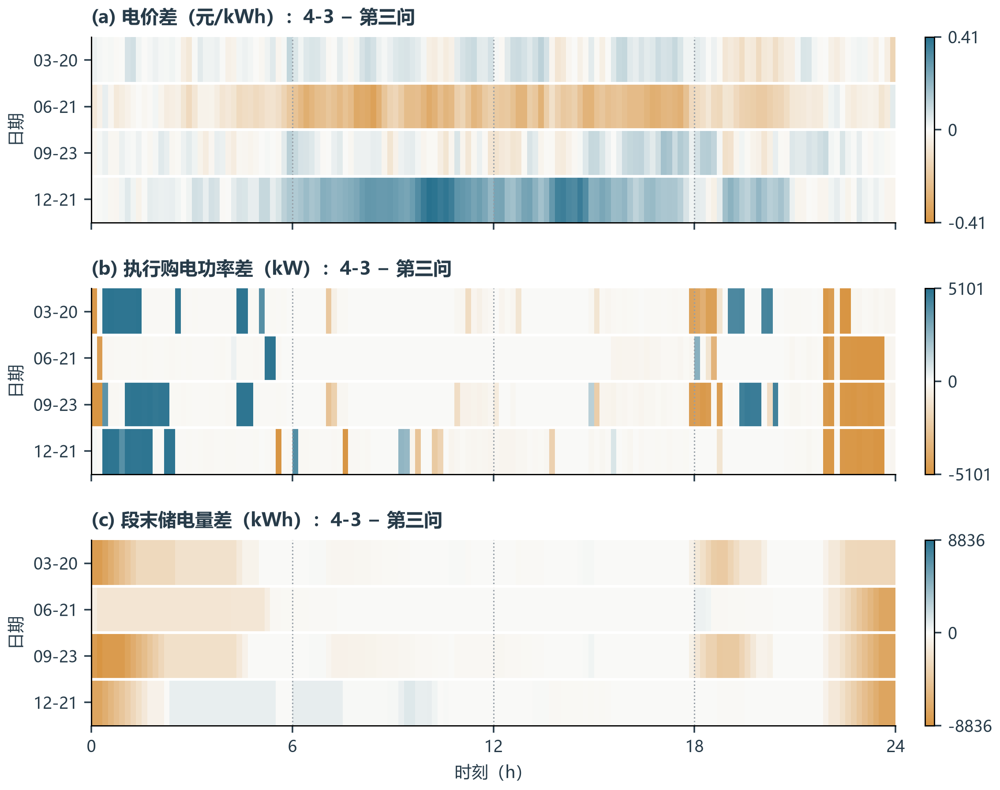

# 新论文图包：图注与正文描述

本文件为新论文提供独立图文材料，图号为本图包临时编号，可按新稿章节调整。下面的“图注”和“正文描述”可直接改编使用；“取数与解释边界”用于核对。

全部年度图统计2025年2月1日至12月31日334天；问题一为附件1典型日。第二问与4-2的初末储电量为8550/6000 kWh，第三问与4-3为6000/6000 kWh；禁止直接用跨口径总费用差宣称策略收益。

## 图1　问题一：分时电价、供需与储能调度

**表达目标：** 解释储能如何协调分时电价、光伏供给和负载，并满足首末电量约束。

[矢量PDF](figures/01_q1_dispatch.pdf) · [PNG](figures/01_q1_dispatch.png)

**图注：** 典型日确定性调度结果。四个面板共享时间轴，依次展示电价、供需与购电功率、储能充放电功率及储电量；水平虚线为1200和10800 kWh的储电量边界，浅色背景仅辅助定位早晚时段。

**正文描述：** 在已知电价、负载和光伏的典型日中，优化购电费为35,126.95元。储能在部分低价时段及光伏富余时段充电，在高价时段放电；购电与充放电的联合安排改变了电量的时段分布。储电量始终位于规定区间内，且日初、日末均为6000 kWh，因此该收益并非通过消耗日初库存获得。

**取数与解释边界：** 读取完整精度solution.npz；每10分钟电量乘6换算为功率；状态曲线含0时初值和144个段末值。浅色时段不参与任何统计分组。

**输入：** `question1/results/solution.npz`

**绘图数据：** [data/01_q1_dispatch.csv](data/01_q1_dispatch.csv)

## 图2　问题一：购电转移与费用节省的账面分解

**表达目标：** 区分增购与少购，说明为什么部分时段多买电，全天费用仍然下降。

[矢量PDF](figures/02_q1_savings.pdf) · [PNG](figures/02_q1_savings.png)

**图注：** 储能调度相对无储能基线的购电差异与费用桥接。左图为优化购电功率减去无储能购电功率；右图按同一时段电价分别累计少购所减少的费用和增购所增加的费用。

**正文描述：** 无储能时的购电费为48,052.05元。储能使部分时段少购电，对应费用减少19,111.64元；同时在另一些时段增购电，对应费用增加6,186.54元。两者抵消后净节省12,925.10元，降幅为26.90%。这一分解是逐时段购电费差额的恒等核算，不将同一节省进一步归因为独立的“光伏消纳效应”或“套利效应”。

**取数与解释边界：** 基线=max(负载−光伏,0)；少购减费=sum[p*max(基线−优化,0)]，增购加费=sum[p*max(优化−基线,0)]。弃光、能量损失及储能约束仍由原模型决定。

**输入：** `question1/results/solution.npz`

**绘图数据：** [data/02_q1_grid_shift.csv](data/02_q1_grid_shift.csv), [data/02_q1_cost_bridge.csv](data/02_q1_cost_bridge.csv)

## 图3　问题二：残差样本口径、成本权衡与启动期收益

**表达目标：** 说明最终选择有效残差与56天等权的依据，以及收益发生的时间和代价。

[矢量PDF](figures/03_q2_residuals.pdf) · [PNG](figures/03_q2_residuals.png)

**图注：** 残差口径的配对比较及最终方案相对原方案的费用变化。(a)连线连接同一窗口规则在两种残差口径下的年度费用点，不是置信区间；(b)分解计划费与紧急费的节省；(c)展示全年累计节省。

**正文描述：** 在具有两种残差口径的三种窗口规则中，排除1月1—7日回退预测残差后，56天等权方案的回测费用最低，为14,389,135.08元。最终方案计划费减少46,129.24元，紧急费增加33,267.35元，净节省12,861.89元。累计收益于启动阶段形成，3月5日至12月31日逐日费用与原方案一致。因此，该改进应解释为残差样本口径调整在启动期的作用，不能据此声称全年持续适应能力提高，也不能据同年回测证明56天窗口对其他年份最优。

**取数与解释边界：** 费用期为2月1日至12月31日334天；原/新方案初末储电量均为8550/6000 kWh。(a)仅选有完整配对的三种规则；11项实验全部保留在数据表中，未生成虚构置信区间。(c)按日期配对累计，不截去后续无差异时段。

**输入：** `question2/results/all_comparisons.csv`, `question2/results/daily_summary.csv`, `question2/results/variants/uniform56/daily_summary.csv`

**绘图数据：** [data/03_q2_all_11_comparisons.csv](data/03_q2_all_11_comparisons.csv), [data/03_q2_daily_savings.csv](data/03_q2_daily_savings.csv)

## 图4　问题三：预报融合与日内调整的逐级收益

**表达目标：** 区分0点预报融合的价值与6、12、18点调整的增量，不把信息更新次数等同于严格改善。

[矢量PDF](figures/04_q3_information_value.pdf) · [PNG](figures/04_q3_information_value.png)

**图注：** 固定电价情形下的逐级费用节省与紧急购电量。费用节省以本问同口径历史预测对照为起点，依次引入0点融合预报和6、12、18点调整；右图按相同顺序比较紧急购电量。

**正文描述：** 四次更新主方案的总费用为14,022,396.98元，相对本问同口径历史预测对照节省367,495.52元。仅引入0点融合预报节省208,447.47元，随后增加6点和12点更新分别节省80,073.56元和79,013.36元；增加18点后费用变化为+38.88元，本年度未显示明确的额外经济收益。四次更新仍作为预设主方案保留。有限经验场景、重新聚类及滚动执行使真实回测费用不必随更新机会增加而严格下降。

**取数与解释边界：** 每次增量为相邻两项已保存总费用之差；不是不同问主方案的直接相减。此对照初末储电量均为6000 kWh，与第二问发布结果的初值不同，不能直接替换第二问费用。负的节省表示费用上升。

**输入：** `question3/results/comparison.csv`

**绘图数据：** [data/04_q3_update_values.csv](data/04_q3_update_values.csv)

## 图5　问题三：预报融合误差与权重变化

**表达目标：** 展示融合预测的精度及动态权重；分开日间与夜间尺度，避免日间大值掩盖夜间误差。

[矢量PDF](figures/05_q3_forecast_fusion.pdf) · [PNG](figures/05_q3_forecast_fusion.png)

**图注：** 发布后六小时光伏预测误差及融合权重。(a)(b)分别比较日间和夜间的历史预测、发布预报及在线融合MAE，两面板纵轴尺度不同；(c)展示各发布时间对应的发布预报权重。

**正文描述：** 6—12时段的MAE由历史预测的309.24 kW降至融合预测的169.41 kW，12—18时段由288.99 kW降至133.68 kW。夜间绝对误差较小，单独绘制以保留其变化尺度。融合权重随历史已成熟样本更新，并包含原算法的偏差修正，因此融合输出不只是当期两条预报的固定加权平均。MAE改善本身不等同于等比例的费用下降，经济效果需结合更新频率对照判断。

**取数与解释边界：** 每个发布时间334天、每天36个十分钟误差；先每日求MAE再等权平均，与这些等长度区间的总体MAE一致。权重为原诊断中的alpha_next_6h；未重估参数。4-3共用此预测诊断，不重复作图。

**输入：** `question3/results/forecast_diagnostics.csv`

**绘图数据：** [data/05_q3_forecast_mae.csv](data/05_q3_forecast_mae.csv), [data/05_q3_forecast_diagnostics.csv](data/05_q3_forecast_diagnostics.csv)

## 图6　问题三：日内购电修正及储能衔接

**表达目标：** 突出日内修正而非两条几乎重合的绝对购电曲线，同时展示紧急补购出现在哪些时段。

[矢量PDF](figures/06_q3_rolling_adjustment.pdf) · [PNG](figures/06_q3_rolling_adjustment.png)

**图注：** 四个指定日的日内计划修正与储能状态。左列为最终执行购电相对0点原计划的功率差，正值为增购、负值为减购；右列为储电量，底部橙色短线标记紧急购电大于数值容差的时段。竖虚线表示6、12、18点发布时刻。

**正文描述：** 日内更新后的购电修正相对原计划较小，直接叠加两条绝对购电曲线容易掩盖变化。以原计划为零基准后，可以清楚识别各执行区间内的增购和减购。储电量按跨日滚动过程衔接，指定日的首末电量不要求逐日相等。紧急购电标记说明计划与储能联合执行后仍可能存在实际供需缺口；该标记只表示发生时间，不表示缺口大小，也不能据其与储能状态的相邻关系断言单一原因。

**取数与解释边界：** 按date/slot排序，保留每个指定日全部144段；(adjusted−original)*6为功率差。该差值是每段最终执行量与0点计划的比较，不是6/12/18点完整计划版本之间的差。短线阈值为1e-6 kWh。

**输入：** `question3/results/schedule_detail.csv`

**绘图数据：** [data/06_q3_adjustments.csv](data/06_q3_adjustments.csv)

## 图7　4-2：价格信息的费用权衡与月度表现

**表达目标：** 在同一实际电价下比较策略；展示主方案为何多支付计划费，以及更充分价格信息的回测价值。

[矢量PDF](figures/07_q42_price_information.pdf) · [PNG](figures/07_q42_price_information.png)

**图注：** 相对原第二问策略按附件4电价重新结算的费用节省。左图将节省分为计划费与紧急费，菱形表示合计，负值表示该项费用增加；右图展示均价预测与联合场景的月度净节省。当日电价已知为信息对照。

**正文描述：** 联合场景主方案的总费用为15,163,043.89元。相对原Q2重新结算，其计划费增加49,557.74元，而紧急费减少71,218.08元，净节省21,660.34元。均价预测方案在本年度比联合场景低2,122.44元，因此不能宣称联合场景取得了回测最低费用。已知当日电价对照比联合场景低130,000.71元，体现更充分价格信息的回测价值，但不构成理论最优下界。月度节省存在正负变化，年度改善不保证各月均改善。

**取数与解释边界：** 四方案均使用相同附件4实际价格、334天及8550/6000 kWh初末电量；费用差按已保存comparison.csv核算。已知当日价格对照仍预测负载/光伏及次日价格。

**输入：** `question4/part2/results/comparison.csv`, `question4/part2/results/monthly_comparison.csv`

**绘图数据：** [data/07_q42_savings.csv](data/07_q42_savings.csv), [data/07_q42_monthly.csv](data/07_q42_monthly.csv)

## 图8　4-2：价格偏差与日前购电的时段重排

**表达目标：** 连接价格输入与购电差异，覆盖四个题目指定日，不只选择一个表现较好的日期。

[矢量PDF](figures/08_q42_schedule_shift.pdf) · [PNG](figures/08_q42_schedule_shift.png)

**图注：** 四个指定日的实际电价、优化采用的场景均价及购电计划差异。左列阴影仅表示两条价格曲线的差距；右列为联合场景计划购电功率减去原Q2计划购电功率，蓝色为增购、橙色为少购。

**正文描述：** 将原第二问策略作为参照，可以观察到价格信息模型引入后购电时段发生重排。场景均价与实际电价并不处处一致，价格曲线形状接近也不保证决策完全相同。联合场景的决策还依赖价格与净负载误差的配对、储能约束及前期形成的状态，因此左、右两列用于对照现象，不将每个购电差值单独归因于同一时段的价格预测误差。此处展示的是日前计划，不应描述为当天观察实际价格后的日内修正。

**取数与解释边界：** 原Q2重新结算策略保留原购电决策，仅改结算价格。按date/slot一对一配对；四日均为144段；功率差=(joint.g−repriced.g)*6。阴影不是预测区间；场景均价不是完整联合场景的替代模型。

**输入：** `question4/part2/results/schedule_detail.csv.gz`, `question4/part2/results/variants/q2_repriced/schedule_detail.csv.gz`

**绘图数据：** [data/08_q42_price_and_shift.csv](data/08_q42_price_and_shift.csv)

## 图9　4-3：相对第三问的费用差额与更新收益

**表达目标：** 把跨情形的账面差额和各情形内部的更新收益分开，避免将不同价格下的费用差当作策略优劣。

[矢量PDF](figures/09_q43_incremental_comparison.pdf) · [PNG](figures/09_q43_incremental_comparison.png)

**图注：** 4-3与第三问主方案的费用差额及更新收益比较。左图按原计划费、净调整费和紧急费分解4-3减第三问的总费用差；右图分别在两问内部计算相邻更新方案之间的费用节省。

**正文描述：** 4-3主方案费用为15,061,735.43元，比第三问高1,039,338.45元。其中紧急费差额为877,139.21元，占总差额的84.39%。该结果是不同电价输入及对应滚动策略共同形成的账面差异，不能全部解释为电价波动或预测误差的因果成本。在各自内部的逐级对照中，增加6点更新的节省由第三问的8.01万元变为4-3的12.20万元，增加12点由7.90万元变为10.45万元；4-3增加18点节省6,875.04元，而第三问费用增加38.88元。这表明新增调整机会的回测价值随运行情形而变化。

**取数与解释边界：** 两问334天、初末电量6000 kWh相同；价格过程与滚动状态不同。净调整费已包含增购、退款及违约费，不重复叠加。跨问差额只作账面描述；内部增量依据各自comparison.csv，未新增反事实优化实验。

**输入：** `question3/results/comparison.csv`, `question4/part3/results/comparison.csv`

**绘图数据：** [data/09_q43_cost_gap.csv](data/09_q43_cost_gap.csv), [data/09_q43_increment_comparison.csv](data/09_q43_increment_comparison.csv)

## 图10　4-3：电价、执行购电和储能状态的差异分布

**表达目标：** 以同日同段配对差异定位两问的不同，避免重复呈现两套结构相同的绝对调度曲线。

[矢量PDF](figures/10_q43_schedule_differences.pdf) · [PNG](figures/10_q43_schedule_differences.png)

**图注：** 四个指定日中，4-3相对第三问的电价、最终执行购电功率及段末储电量差值。蓝色表示4-3更高，橙色表示更低，白色表示接近零；各面板使用独立的对称色标，数值未裁剪，竖虚线为6、12、18点。

**正文描述：** 配对差值图保留了两问在相同实际负载与光伏条件下的时段对应关系。电价、购电与储能状态的差异具有不同的时间分布，显示调度响应包含跨时段的能量转移。各指定日的初始储电量已由此前滚动执行决定，两问并不相同，因此状态差异既包含当日决策差异，也包含前期累积影响。图中比较用于描述两套已保存运行结果，不能将某一列的颜色直接解释为另一列的因果效应。

**取数与解释边界：** date/slot完整一对一配对；每个面板576个十分钟值，不按小时平均、不平滑、不选择极端日、不使用分位截断。单位不同，三个色标独立；储电量取段末值，初始状态另见数据表。

**输入：** `question3/results/schedule_detail.csv`, `question4/part3/results/schedule_detail.csv`

**绘图数据：** [data/10_q43_paired_differences.csv](data/10_q43_paired_differences.csv), [data/10_q43_initial_states.csv](data/10_q43_initial_states.csv)
