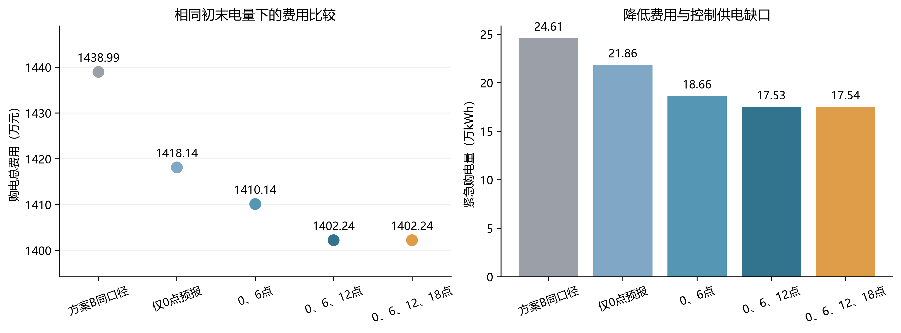

> 整理说明：下文数值及完整复现结论来自整理前的结果文件和原作者记录。本次按用户要求不重跑优化，仅检查搬迁、导入、输入读取和文件完整性；结果文件现位于 `results/`。

# 第三问结果说明

结果期为2025年2月1日至2025年12月31日，共334天。采用在线预报融合、经验场景树LP和跨日滚动执行；详见 [建模说明.md](建模说明.md)。

**费用口径**：取消部分退原费、另付50%违约费；费用按供电时段电价计算。原计划费、增购费、退款、违约费、紧急费分开记账。

## 全年对照

| 方案 | 总费用（元） | 紧急购电量（kWh） |
|---|---:|---:|
| 方案B框架同口径复算 | 14,389,892.50 | 246,099.33 |
| 仅使用0点融合预报 | 14,181,445.03 | 218,589.30 |
| 0、6点 | 14,101,371.47 | 186,570.89 |
| 0、6、12点 | 14,022,358.10 | 175,344.39 |
| 0、6、12、18点（主方案） | 14,022,396.98 | 175,369.95 |

## 主方案费用分解

| 项目 | 金额（元） |
|---|---:|
| 原计划购电费 | 13,345,819.30 |
| 增购费（1.5倍） | 89,947.28 |
| 取消原费退款 | −150,170.13 |
| 取消违约费（50%） | 75,085.07 |
| 净调整费 | 14,862.22 |
| 紧急购电费（5倍） | 661,715.46 |
| **总费用** | **14,022,396.98** |

净调整费已经包含增购费、退款和违约费，计算总额时不能重复叠加这三项。

相对同口径方案B，主方案节省 **367,495.52元（2.55%）**；紧急购电量减少 **28.74%**。

## 是否需要每次都调整

- 从“方案B框架同口径复算”改为“仅使用0点融合预报”，全年减少费用 208,447.47 元。
- 从“仅使用0点融合预报”改为“0、6点”，全年减少费用 80,073.56 元。
- 从“0、6点”改为“0、6、12点”，全年减少费用 79,013.36 元。

加入18点更新后，全年费用变化为 **+38.88元**。此差值很小，数据未显示18点更新有明确的额外经济收益。建议重点保留6点和12点调整；18点可以作为可选更新。

该结论限于本数据和算法：18点仍可能通过次日预报影响跨日储能，不能断言其永远无用。小型经验树重新聚类、滚动重算、有限样本和真实误差会使回测费用并非严格随信息增多而下降。

主结果 [result3.xlsx](results/result3.xlsx) 保留预设的四次更新方案；[0、6、12点结果](results/comparisons/at_0_6_12/result3.xlsx) 单独提供。上述更新频率比较属于本年度数据上的方案分析。

## 题目指定日期

| 日期 | 原计划费（元） | 净调整费（元） | 紧急电量（kWh） | 紧急费（元） | 总费用（元） | 0点/24点储电量（kWh） |
|---|---:|---:|---:|---:|---:|---:|
| 2025-03-20 | 39,999.75 | -94.14 | 873.52 | 3,380.75 | 43,286.36 | 8,583.54 / 4,246.51 |
| 2025-06-21 | 24,123.60 | -105.75 | 342.74 | 1,184.60 | 25,202.45 | 2,292.66 / 8,533.70 |
| 2025-09-23 | 43,523.27 | -155.36 | 949.18 | 4,198.58 | 47,566.49 | 8,535.99 / 8,517.90 |
| 2025-12-21 | 63,209.93 | -75.36 | 607.81 | 1,955.82 | 65,090.39 | 8,573.87 / 8,576.96 |

表1的指定十分钟购电量、表2的六个四小时充放电量、表3的全部紧急时间区间，分别保存在 `results/target_table1.csv`、`results/target_table2.csv`、`results/target_table3.csv`；日汇总及首末SOC保存在 `results/target_daily.csv`。

## 核验与解释边界

- 主方案及对照的初末SOC统一为6000 kWh，能量递推、上下限、功率、充放电互斥、跨日连续和实际缺口均逐段核验。具体误差见 `results/verification.json`。
- `code/verify_q3.py` 另对三天四个发布时刻做未来信息扰动，反读Excel并独立核算费用；应以该脚本更新后的 `results/verification.json` 为完整检查记录。
- 方案B的历史内核参数由既有方案继承，不能据本次因果执行检查声称原参数选择过程一定没有用过测试数据。
- 取消量若不退还原费，同一主调度的费用会增加退款总额；该敏感性写入核验JSON。若更换结算解释，应重新优化，不能只换最终报表公式。
- 主方案为有限经验场景上的LP加滚动执行，不宣称全年真实随机问题全局最优。

## 图表

## 探索结果与主方案边界

[探索最终报告](research/问题三_优化探索最终报告.md) 推荐的主费用为 **14,022,396.98089594元**（1402.24万元），来自 [summary.json](results/summary.json)；场景缩放 $k=0.92$ 的约1401.77万元仅保留作敏感性分析，不能混填主结果Excel。全部原脚本、JSON和日志见 [research](research/)。

探索报告中的下界差额不等价于已证明的“全部预报误差成本”；MAE比较和有限调参不能证明全局最优或13xx万元不可达。论文采用这些结果时应限制到已测试模型族和同年度回测。总费用需包含原计划费、净调整费和紧急费，不能仅相加计划费与紧急费。
