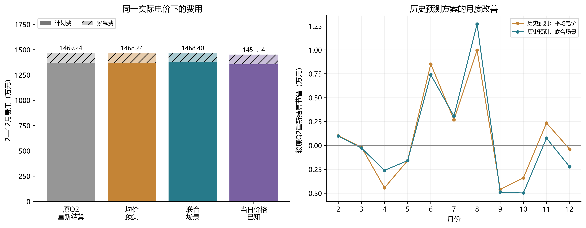
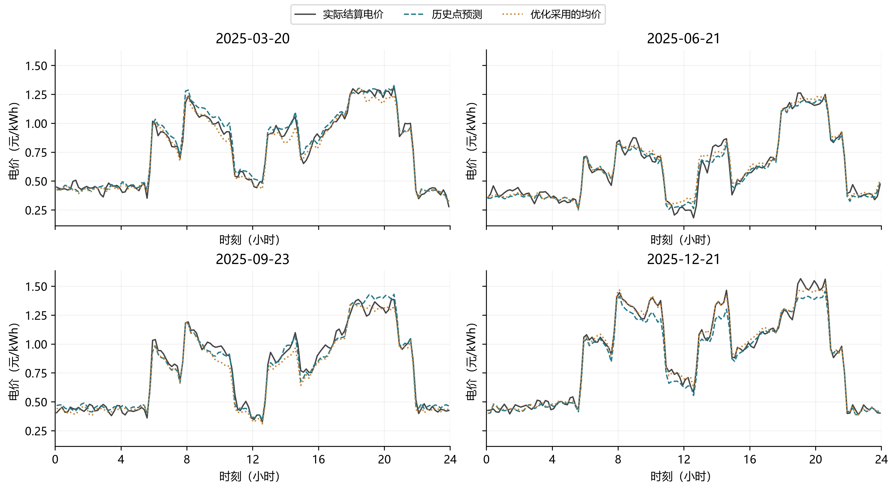
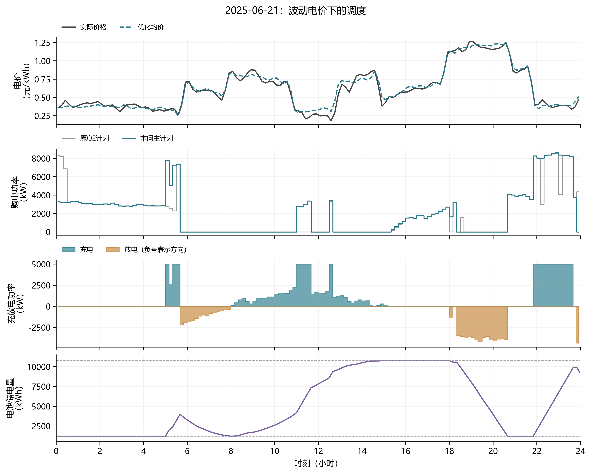

# 第4问4-2计算结果

根目录发布方案：**历史预测：联合场景**。完整策略见 [result4-2.xlsx](result4-2.xlsx)。

**统计期为2025年2月1日至12月31日334天**，所有方案2月初储电量8315.1247 kWh、年末6000 kWh。1月沿用Q2策略共同预热，不计入下表费用。

## 1. 相同实际电价下的比较

| 方案 | 计划购电费（元） | 紧急购电费（元） | 总费用（元） | 较原Q2重新结算节省（元） |
|---|---:|---:|---:|---:|
| 原Q2按新电价结算 | 13,714,598.90 | 977,811.17 | 14,692,410.07 | 0.00 |
| 历史预测：平均电价 | 13,696,204.85 | 986,227.24 | 14,682,432.08 | 9,977.99 |
| 历史预测：联合场景 | 13,770,221.84 | 913,806.71 | 14,684,028.55 | 8,381.52 |
| 当日电价已知 | 13,541,704.12 | 969,681.01 | 14,511,385.13 | 181,024.95 |

联合场景模型比重新结算的Q2节省 **8,381.52元（0.0570%）**。计划费增加 55,622.94 元，紧急费减少 64,004.46 元，合计费用下降。

紧急电量从 239,906.65 kWh降至 221,663.23 kWh，减少 18,243.42 kWh；剩余弃置电量从 3,168,047.68 kWh增至 3,264,155.51 kWh。它体现更保守的高价缺电覆盖，不能只看紧急电量而忽略多买和弃置。

原优化Q2在附件1固定电价下为14,389,135.08元。附件4改变了计费条件，不能直接把本问与该数字相减作为策略优劣。正确基准是保留Q2所有决策、按附件4重新结算后的15,184,704.23元。

## 2. 哪些结论成立，哪些不能过度解释

- 平均电价简化模型费用 **14,682,432.08元**，比联合场景模型低 **1,596.47元**。联合场景在本年度没有显示稳定优于均价近似的证据；若优先考虑实施简单，平均电价方案是完整可用的替代方案。
- 默认主文件采用联合场景，是因为它对应所声明的电价与净负载同时不确定的模型，并非宣称它是这些回测方案中实际费用最低的一套。
- 当日电价已知对照费用 **14,511,385.13元**。它比联合场景低 172,643.43 元，体现本次回测中更充分价格信息的价值；不是已证明的理论下界。
- 已知电价对照仍使用预测负载和光伏，不读取未来真实净负载；48小时窗口中次日价格也只能预测。
- 月度节省有正有负，结果不证明任意月份、其他年份均能改善，也不证明全局最优策略。

## 3. 电价模型及数据检查

四个候选仅用1月8—31日的24个历史预测日比较RMSE，入选“最近4次同星期几均价”。2月起固定规则，没有用正式统计期费用选择预测参数。
附件4为365×144个完整正电价，范围 0.0076—1.7936元/kWh。2—12月点预测RMSE为 0.069629元/kWh，MAE为 0.048865元/kWh。
加性误差场景中的正数下限为0.001元/kWh，共有 239 个场景价格被截断，占 2,617,344 个场景价格的 0.0091%；原始实际价格没有截断。该下限是模型假设，未据回测费用调参。

## 4. 指定日期结果

完整表1、表2、表3见 [指定日期结果.md](指定日期结果.md)，机器可读表格见 target_days/。

| 日期 | 计划购电量（kWh） | 紧急购电量（kWh） | 计划费（元） | 紧急费（元） | 总费（元） |
|---|---:|---:|---:|---:|---:|
| 2025-03-20 | 62,213.1815 | 631.4503 | 39,504.34 | 2,706.13 | 42,210.47 |
| 2025-06-21 | 47,739.0717 | 311.2889 | 22,017.88 | 1,037.19 | 23,055.07 |
| 2025-09-23 | 69,972.1871 | 1,057.4019 | 44,714.46 | 4,936.91 | 49,651.37 |
| 2025-12-21 | 95,409.6613 | 517.3582 | 71,752.65 | 2,334.53 | 74,087.18 |

Excel“全天购电费”填写计划购电费，与计划购电表一致；紧急费及总费另在逐日CSV、汇总JSON和上表中列明。

## 5. 已完成核验

- 四套方案各48,096个正式时段全部通过独立附件核验：实际电价、净负载、能量守恒、0.9效率、功率、SOC、互斥、跨日连续、末日状态、紧急电量及费用。
- 1月4,464个预热时段独立复算，从6000 kWh连续到8315.1247 kWh；四套Excel均反读全部三个工作表及时间区间。
- 人工篡改电价、储电量和紧急电量，核验器均能拒绝。
- 固定电价退化例与原Q2目标值之差为0；两组价格—净负载配对解析例费用18,720元、30,240元，均与LP一致。
- 对2月1日、6月1日、11月30日同时改动当天及未来价格、负载、光伏，历史预测主模型的当前预测、场景和控制量变化均为0。
- 当日电价已知方案中，改变次日及以后实际价格，当前决策不变。源Q2代码、输出及原附件指纹未变。

## 6. 图表

建模公式、信息口径、为什么仍可用LP以及分位数解释见 [建模说明.md](建模说明.md)。
